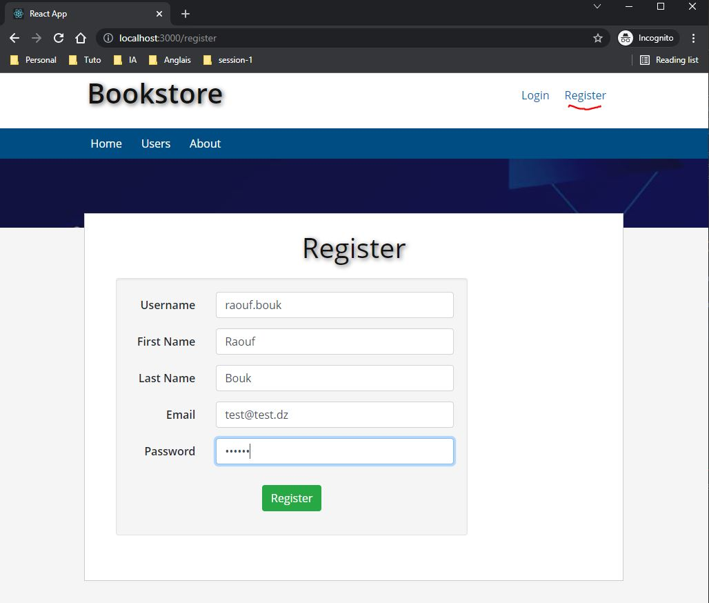
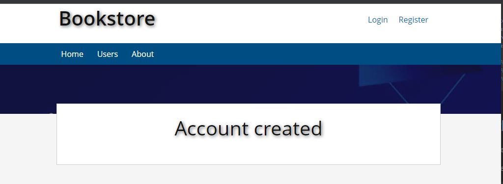
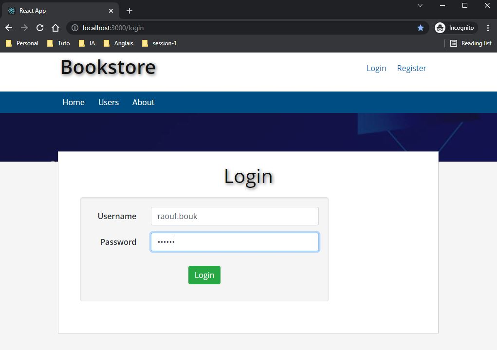
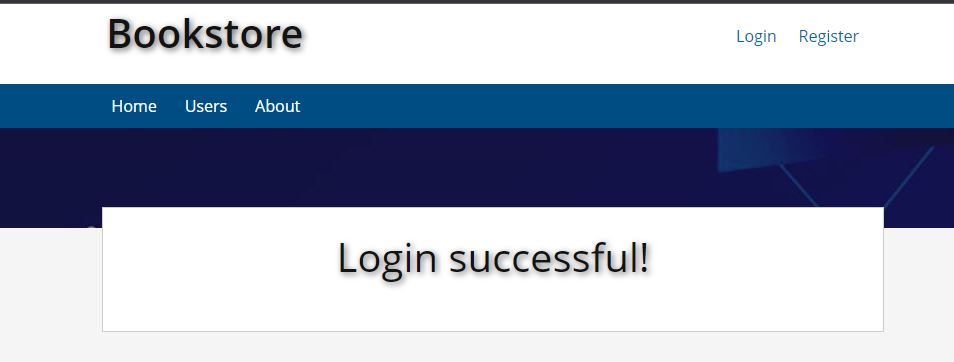
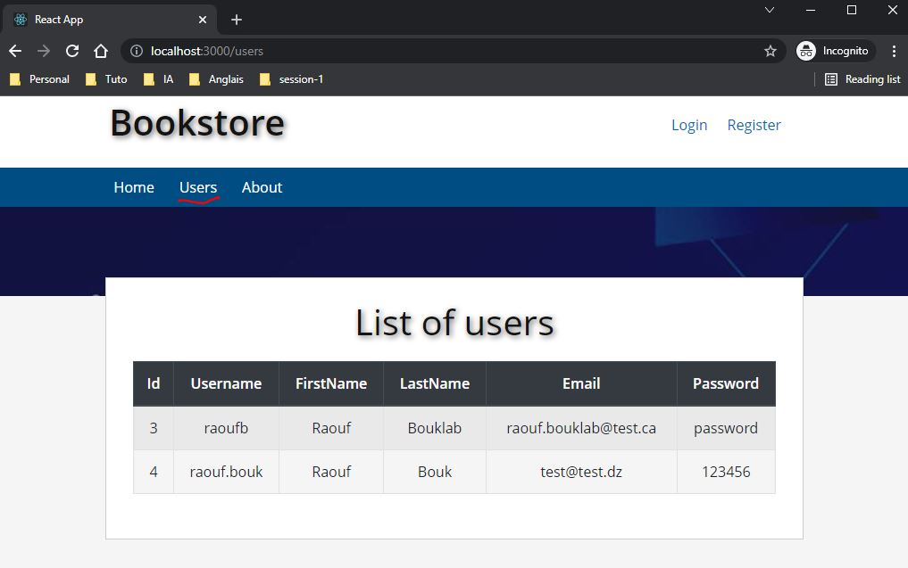

# login-register-spring-reactjs-mysql-docker

# Getting Started
In this tutorial we'll cover how to implement user registration and login functionality with React and spring boot using MySql database.


### Run the app in docker
```
cd login-register-spring-reactjs-mysql-docker/backend
mvn clean package
cd ..
docker-compose up --build
```

### Connect to database using MySQL Shell :
In the command line, run :
```
docker exec mysql-db mysqld --skip-grant-tables
```

In the MySQL Shell, run the command :
```
\sql

\connect --mysql user@localhost:3306/bookstore

password : password

use bookstore;
describe user;
describe role;
describe user_role;

select * from role;
select * from user;
select * from user_role;
```

# Test the application :

Browse to the backend at http://localhost:8082/swagger-ui.html#/

Browse to the frontend at http://localhost:3000

### To register :



### To login :



### To display the list of users :

 
